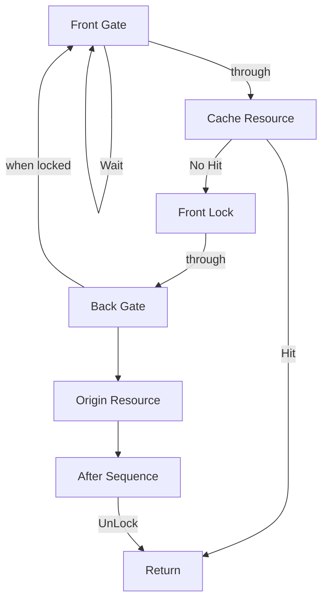

## T-Way Lock

仮の名前。
ここではあるリクエストを受けた時にCacheに振るか再取得を行うかといった
中間Cacheのない場合にオリジナルに取得に移動し、その間のリクエストを一時的にWaitする仕組み

1. no lockでリクエストを通して
2. cache hitしなかったら 入り口をlockする。その処理は上流に戻す
3. オリジナルへリクエストをして結果を受け取る
4. cacheに登録後にLockを解除

完全並列な動作を想定する
1. FlontGate通過後にすでにOriginRequestがあればFrontGateに戻る
2. OriginRequest失敗時は既定のリトライを行う
3. 取得できなかった場合は残りのRequestもすべて失敗させる

